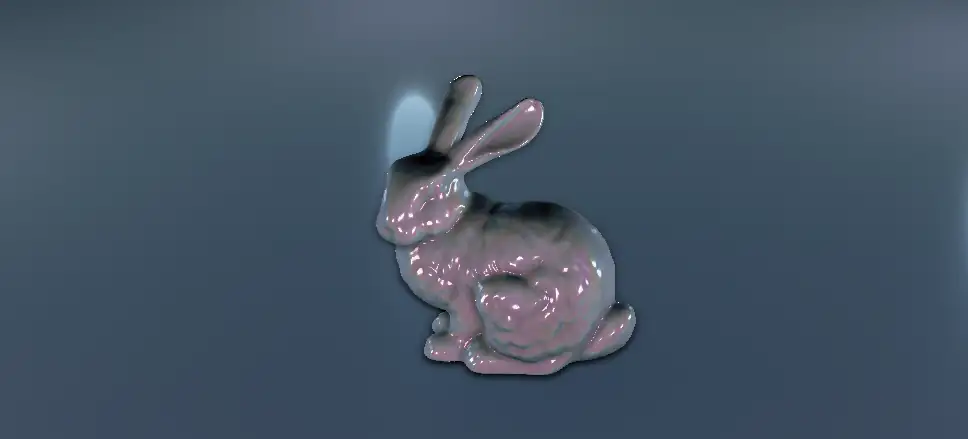

# 余談

## 開発経緯

## interactive_slam

研究で取り組んでいた[interactive_slam](https://github.com/koide3/interactive_slam)というプロジェクトがあり、これがIridescenceのもとになりました。この interactive_slam では 3D LiDAR SLAM のうまく処理できていない箇所を、ユーザがインタラクティブに指定・修正することで、自動での地図生成が困難な環境においても高品質な地図を生成できるようにすることを目指していました。

このプロジェクトではインタラクティブな地図修正が肝だったため、直感的に操作しやすい3D表示とUIが必要でした。当初はROSを使い慣れていたこともあってrvizにインタフェースプラグインを追加する形で実装を進めていましたが、3D表示は細かい制御ができず、またrviz上ではUIの柔軟な拡張が難しかったため、最終的には独自に3DビューワとUIシステムを実装することにしました。

!!!さらに余談
    個人的な意見ですがrvizを可視化の主軸にした研究開発はかなり効率が悪いと感じています。自作プログラムと表示が別プロセスに分離しているせいで表示の遅延や同期の問題が発生しやすく、またオブジェクトの姿勢変更は基本的にTFを介して行う必要があるため細かい制御がしづらいです。さらにUIの拡張性も低く、複雑なインタラクションを実装するのはかなり困難です。研究開発においては、表示とロジックが密に連携できることが重要であり、その点でrvizはあまり適していないと感じます。  
    誤解のないように補足すると、rvizはロボット開発のような複数のノードが協調・連携するシステムの開発においては非常に有用であり、その点では優れたツールです。しかし、単一のアプリケーション内での柔軟なインタラクションやリアルタイムなフィードバックが求められる研究開発には不向きだと感じています。

学生時代から3Dグラフィクスに興味があってOpenGLに触れていたこともあり、またROSとの連携が念頭にあったためクロスプラットフォームなGLFW + OpenGLで動作するアプリケーションを作成しました。UIは色々検討した結果、Dear ImGuiを採用しました。Dear ImGuiはゲーム開発に広く使用されている即時モードGUIライブラリ（コードで実行される順序そのままにGUIが構築される）で、非常に軽量かつ多機能・柔軟です。また、アルゴリズム開発などで多用していた線形代数ライブラリのEigenをデータ構造の中心に据えることとしました。

ガリガリプログラムを作成してそこそこ満足行くGUIと3D表示を実装でき、成果を論文・OSSとして公開できました。

<iframe width="640" height="380" src="https://www.youtube.com/embed/vAqo6YkbKpU?si=IIXNooYjTbjTL6qK" title="YouTube video player" frameborder="0" allow="accelerometer; autoplay; clipboard-write; encrypted-media; gyroscope; picture-in-picture; web-share" referrerpolicy="strict-origin-when-cross-origin" allowfullscreen></iframe>

## Iridescence

interactive_slamの完成後も、研究プロジェクトで同様のGUIと3D表示が必要になることがありました。毎回コードを複製・修正するのは非効率的だったため、これらのコードをライブラリ化し、より汎用的に使えるように整備したものがIridescenceです。

### ライブラリ名

interactive_slamのコードベースをIridescenceとしてまとめ上げるときに、追加しようと考えていた機能がいくつかありました。その一つが「点群を美しくレンダリングする」ことでした。と言っても特に具体的なイメージがあったわけではなく、「なんかきれいに表示したいなあ」と漠然とした考えがあっただけだったので、「美しい点群レンダリングとはなんだろう」と悩んでいました。その中で調べものをするうちに[彩雲(Cloud iridescence)](https://ja.wikipedia.org/wiki/%E5%BD%A9%E9%9B%B2)という現象を知りました。彩雲は雲が太陽光を回折させることで虹色に輝く現象で、点群でこれを表現できたら面白いなと思いました。

[CC-BY-SA-3.0: C messier. WikiMedia](https://commons.wikimedia.org/wiki/File:Highly_iridising_altocumulus.jpg)

結果として点群で彩雲を表現することはうまくできませんでした。彩色のような色合い変化を再現するために[遊色効果(Iridescence)](https://en.wikipedia.org/wiki/Iridescence)を取り入れたBRDFを実装したり、点群の隙間を穴埋めするためのSplatting、スクリーンスペースでのアンビエントオクルージョンやライティング処理などを試みましたが、LiDARのような実際のセンサから得られた点群はノイズなどの影響で美しくレンダリングするのが難しく、彩雲のような効果を得ることはできませんでした。

遊色効果付きBRDFレンダリング([ext_light_viewer_brdf](https://github.com/koide3/iridescence/blob/master/src/example/ext_light_viewer_brdf.cpp))

ポイントスプラッティングによる点群レンダリング

最終的に美しさは妥協して、点群は単に高さをカラーマップでエンコードする形でレンダリングすることに落ち着きましたが、志は残しておこうかと思い、ライブラリ名をIridescenceとしました。カラーマップモードを`RAINBOW`と呼称しているのはこのときの名残です。このモード名は実際の機能をうまく表していないので変更したいのですが、あまりに中心的に使用しているところのため変更できず名付けを後悔しています。その他にも発展的に開発してきたので後悔ポイントは若干ありますが、全体としては個人の研究開発用の可視化ライブラリとしてはそれなりに満足しています。

### 可視化とUIについて

Iridescenceは点群処理やロボット開発を中心にした活動においては使いやすいものになっていると思います。そのまま皆さんの研究開発に役立ててもらえると思いますが、もしあなたが若手の研究者・開発者であれば、自分独自の可視化ライブラリを作成することも検討してみるといいと思います。

作成しているアルゴリズムやプログラムの内部動作がどうなっているかを深く理解することは、研究開発において非常に重要です。可視化することでアルゴリズムの挙動を直感的に把握でき、問題点や改善点を見つけやすくなります。各問題における適切な可視化方法は問題ごとに異なるため、自分の研究内容に最適化された可視化ツールを持つことは大きな利点となります。Iridescenceやその他の可視化ライブラリが手に馴染むまで使いこなして見るものいいですし、自分で一から作成してみるのも良い経験になると思います。

また、研究開発において操作UIはあまり注目されていない箇所ですが非常に重要だと思います。柔軟なUIを効率よく実装できると、トライアルアンドエラーが高速に回せるようになり、研究開発の効率が大幅に改善します。使用し始めて気づきましたが、ImGuiはゲーム開発だけでなく、研究開発やツール開発においても非常に有用でした。インタラクティブにパラメータを調整しながら挙動を確認できるため、アルゴリズム理解が深まりより良い実装を迅速に行うことができました。最近の海外の研究現場でもImGuiなどを利用したUI実装が増えているように感じる一方、国内ではrvizなどの汎用可視化ツールを無理くり使っている様子が多く、あまり普及していないように思います。独自の可視化ライブラリを作成する際には、ぜひ良いUIを取り入れてみてください。

